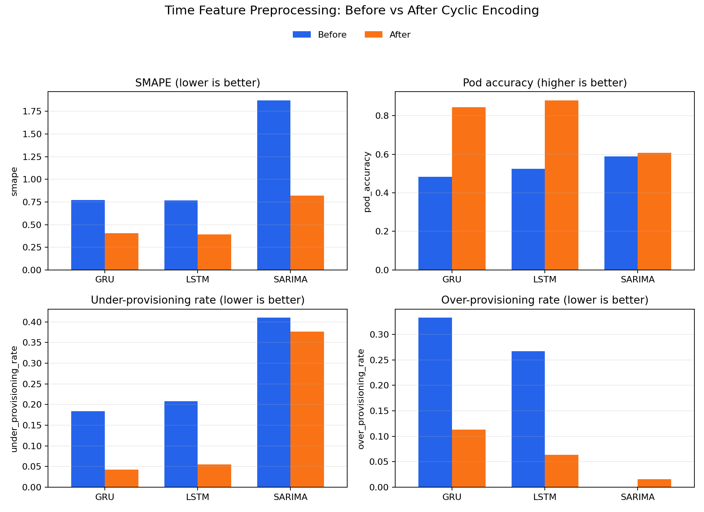

# 🌱 콩콩팥팥 · AI Prediction Model

> Kubernetes predictive autoscaling에 사용할 **트래픽 예측 모델**을 선정하기 위한 실험 레포입니다.
> Prophet, SARIMA, GRU, LSTM을 동일한 synthetic traffic data와 동일한 autoscaling 평가 기준으로 비교하고, **pod 부족 위험(Under-provisioning rate)**을 기준으로 최종 **기본 GRU**를 선정했습니다.


---

## 목차

1. [프로젝트 목적](#purpose)
2. [전체 파이프라인](#pipeline)
3. [문제 정의](#problem)
4. [실험 설계](#setup)
5. [실험 결과](#results)
6. [최종 사용 모델](#final-model)
7. [Troubleshooting](#troubleshooting)
8. [기술 스택](#tech-stack)
9. [디렉터리 구조](#directory)
10. [참고 문서](#docs)
11. [관련 레포지토리](#repositories)

---

<a id="purpose"></a>

## 🎯 1. 프로젝트 목적

Reactive autoscaling은 트래픽 증가가 발생한 뒤 pod 수를 조정합니다. 급격한 트래픽 증가가 발생하면 HPA가 반응하기 전까지 지연이 생기고, 이 구간에서 서비스 응답 지연이나 장애가 발생할 수 있습니다.

이 프로젝트는 트래픽을 사전에 예측하고 예측값을 required pod 수로 변환해, Kubernetes autoscaling에 사용할 예측 모델을 선정하는 것을 목표로 합니다.

최종 판단에서는 예측 오차보다 **pod 부족 위험**을 더 중요하게 보았습니다. 따라서 primary metric은 `Under-provisioning rate`로 둡니다.

---

<a id="pipeline"></a>

## 🔁 2. 전체 파이프라인

```text
Synthetic agriculture traffic data
        |
        v
data/processed/traffic.csv
        |
        +--> Prophet baseline
        +--> SARIMA baseline
        +--> GRU baseline
        +--> LSTM baseline
        |
        v
1차 모델 비교
        |
        +--> GRU/LSTM 튜닝 대상으로 선정
        |
        +--> Optuna tuned GRU
        +--> Optuna tuned LSTM
        |
        v
2차 모델 비교
        |
        v
최종 모델: 기본 GRU
```

---

<a id="problem"></a>

## ❓ 3. 문제 정의

- 입력: 시간별 트래픽 데이터와 weather/calendar feature
- 출력: holdout 구간의 트래픽 예측값과 required pod 수
- 목표: 동일한 데이터와 holdout 조건에서 후보 모델을 비교하고 최종 사용 모델을 선정
- Primary metric: `Under-provisioning rate`

자세한 문제 정의는 [`docs/problem-definition.md`](docs/problem-definition.md)를 참고합니다.

---

<a id="setup"></a>

## 🧭 4. 실험 설계

후보 모델, 데이터 생성 방식, 전처리 방식, 평가 기준을 정리합니다.

<a id="candidates"></a>
<details>
<summary><strong>🧪 4-1. 후보 모델</strong></summary>
<br>

| 모델 | 역할 |
| --- | --- |
| Prophet | 계절성과 이벤트성 변동을 빠르게 반영하는 baseline |
| SARIMA | 전통적인 통계 기반 시계열 baseline |
| GRU | 순차 패턴을 학습하는 경량 recurrent neural network |
| LSTM | 장기 의존성을 고려하는 recurrent neural network |

1차 비교에서는 네 모델을 모두 평가하고, autoscaling 지표가 우수한 GRU와 LSTM만 2차 튜닝 대상으로 선정했습니다.

모델별 입력 feature는 [`docs/experiment-design.md`](docs/experiment-design.md)를 참고합니다.

</details>

<a id="data-generation"></a>
<details>
<summary><strong>🌱 4-2. 데이터 생성 방식</strong></summary>
<br>

Synthetic traffic data는 농자재 BNPL 서비스의 계절적 수요를 반영하도록 생성했습니다. 주요 작물은 벼, 고추, 콩, 마늘, 양파로 두고, 파종/정식, 생육 관리, 수확, 상환 조회 시기를 트래픽 패턴에 반영합니다.

기본 생성 기간은 `2020-01-01`부터 `2024-12-31 23:00`까지의 5년이며, 단위는 1시간입니다.

`data/processed/traffic.csv` 주요 컬럼:

| 컬럼 | 의미 |
| --- | --- |
| `ds` | timestamp |
| `y` | 예측 대상 request rate |
| `request_rate` | synthetic request rate |
| `cpu_utilization` | synthetic CPU utilization |
| `is_monsoon` | 장마 여부 |
| `typhoon_index` | 태풍 영향 지수 |
| `hour`, `day_of_week`, `month` | calendar features |

작물별 월별 활동도, 요일/시간대 패턴, 장마/태풍, 이상 이벤트 계산식 등 생성 로직 상세는 [`docs/experiment-design.md`](docs/experiment-design.md)의 "트래픽 생성 로직"을 참고합니다.

</details>

<a id="preprocessing"></a>
<details>
<summary><strong>⚙️ 4-3. 전처리 방식</strong></summary>
<br>

모든 모델은 `data/processed/traffic.csv`를 기준으로 학습합니다. 학습 전에는 모델 입력 형태에 맞춰 timestamp 정렬, target 컬럼 정리, weather/calendar feature 구성, sequence window 생성 등을 수행합니다.

SARIMA와 GRU/LSTM은 `hour`, `day_of_week`, `month`를 순환 feature로 변환해 사용합니다. GRU와 LSTM은 추가로 train 구간 기준 scaling parameter를 계산하고, 과거 window를 입력으로 만들어 다음 시점의 `y`를 예측합니다.

cyclic encoding을 도입하게 된 배경과 전후 성능 비교는 [`docs/experiment-notes.md`](docs/experiment-notes.md)를 참고합니다.

</details>

<a id="evaluation"></a>
<details>
<summary><strong>📏 4-4. 평가 기준</strong></summary>
<br>

모델 비교는 timestamp 기준 chronological split으로 진행합니다.

```text
train: 앞쪽 80%
holdout: 뒤쪽 20%
```

Random split은 사용하지 않습니다. 시계열 예측 상황을 유지하기 위해 과거 데이터로 학습하고 미래 구간을 holdout으로 평가합니다. GRU/LSTM의 holdout 예측에서는 이전 예측값을 다시 입력으로 사용하는 recursive forecast 방식을 사용합니다.

평가는 [src/evaluation/metrics.py](src/evaluation/metrics.py)와 [src/evaluation/pod_policy.py](src/evaluation/pod_policy.py)의 공통 로직을 사용합니다.

기본 pod 정책:

```text
capacity_per_pod = 21.1
safety_margin = 0.2
min_pods = 1
max_pods = 8
```

| 지표 | 최적화 방향 | autoscaling 관점 |
| --- | --- | --- |
| SMAPE | 낮을수록 좋음 | 트래픽 예측 정확도 |
| Pod accuracy | 높을수록 좋음 | required pod decision 일치도 |
| Under-provisioning rate | 낮을수록 좋음 | 서비스 지연/장애 위험 |
| Over-provisioning rate | 낮을수록 좋음 | 불필요한 pod 비용 |

Autoscaling에서는 pod 부족이 서비스 장애로 이어질 수 있으므로 `Under-provisioning rate`를 primary metric으로 둡니다.

자세한 기준은 [`docs/model-selection-criteria.md`](docs/model-selection-criteria.md)를 참고합니다.

</details>

---

<a id="results"></a>

## 🏁 5. 실험 결과

1차 모델 비교, 최적화, 2차 모델 비교 결과를 정리합니다.

<a id="comparison-1"></a>
<details>
<summary><strong>📊 5-1. 1차 모델 비교: 튜닝 대상 선정</strong></summary>
<br>

5년치 synthetic data 기준으로 Prophet, SARIMA, GRU, LSTM을 동일한 holdout 조건에서 비교했습니다. 이 단계의 목적은 최종 모델을 바로 확정하는 것이 아니라, Optuna로 추가 최적화할 sequence model 후보를 선정하는 것입니다.

| Rank | 모델 | SMAPE | Pod accuracy | Under-provisioning rate | Over-provisioning rate | 비고 |
| ---: | --- | ---: | ---: | ---: | ---: | --- |
| 1 | **GRU** | 0.4064 | 0.8442 | **0.0426** | 0.1131 | 튜닝 대상 선정 |
| 2 | **LSTM** | 0.3931 | 0.8806 | 0.0555 | 0.0639 | 튜닝 대상 선정 |
| 3 | Prophet | 0.6368 | 0.6832 | 0.1268 | 0.1900 | baseline |
| 4 | SARIMA | 0.8197 | 0.6083 | 0.3762 | 0.0155 | statistical baseline |

GRU와 LSTM은 Prophet, SARIMA보다 under-provisioning rate와 pod accuracy 측면에서 더 좋은 결과를 보였습니다. 따라서 2차 실험에서는 GRU와 LSTM만 튜닝 대상으로 선정했습니다.


동일한 표는 [`docs/final-decision.md`](docs/final-decision.md)의 "1차 모델 비교" 절에도 있습니다.

</details>

<a id="optimization"></a>
<details>
<summary><strong>🔧 5-2. 최적화 방식</strong></summary>
<br>

GRU와 LSTM에 대해 Optuna 기반 하이퍼파라미터 튜닝을 수행했습니다. 튜닝 objective score는 under-provisioning rate를 중심으로 SMAPE와 over-provisioning rate를 보조 penalty로 반영합니다.

```text
score = under_provisioning_rate + 0.1 * smape + 0.2 * over_provisioning_rate
```

탐색 대상은 sequence length, hidden size, learning rate, epochs, batch size, recurrent layer 수, dropout, weight decay, gradient clipping 등입니다. 각 파라미터의 의미와 탐색 범위는 [`docs/sequence-tuning-parameters.md`](docs/sequence-tuning-parameters.md)에 별도로 정리합니다.

튜닝 실행 방법은 [`docs/run-guide.md`](docs/run-guide.md)를 참고합니다.

</details>

<a id="comparison-2"></a>
<details>
<summary><strong>📊 5-3. 2차 모델 비교: 튜닝 전후 비교</strong></summary>
<br>

2차 비교에서는 기본 GRU/LSTM과 Optuna로 생성한 Tuned GRU/Tuned LSTM을 비교했습니다. 이 단계의 목적은 튜닝이 실제 holdout 성능을 개선했는지 확인하고, 최종 사용 모델을 결정하는 것입니다.

| 모델 | SMAPE | Pod accuracy | Under-provisioning rate | Over-provisioning rate | 비고 |
| --- | ---: | ---: | ---: | ---: | --- |
| **GRU** | 0.4064 | 0.8442 | **0.0426** | 0.1131 | 최종 선정 |
| Tuned GRU | 0.4117 | 0.8432 | 0.0667 | 0.0901 | 비용 지표 일부 개선 |
| LSTM | 0.3931 | 0.8806 | 0.0555 | 0.0639 | 정확도 우수 |
| Tuned LSTM | 0.3835 | 0.8819 | 0.0666 | 0.0515 | 정확도/비용 지표 개선 |

Tuned LSTM은 SMAPE, pod accuracy, over-provisioning rate를 개선했고, Tuned GRU도 over-provisioning rate를 낮췄습니다. 그러나 두 tuned 모델 모두 primary metric인 under-provisioning rate가 기본 GRU보다 높았습니다.

따라서 최종 비교에서는 서비스 안정성 기준을 우선해 under-provisioning rate가 가장 낮은 기본 GRU를 최종 사용 모델로 선정했습니다.


동일한 표는 [`docs/final-decision.md`](docs/final-decision.md)의 "2차 모델 비교" 절에도 있습니다.

</details>

---

<a id="final-model"></a>

## 🏆 6. 최종 사용 모델

최종 사용 모델은 **기본 GRU**입니다.

선정 이유:

- 1차 비교에서 under-provisioning rate가 가장 낮았습니다.
- 2차 비교에서도 tuned GRU/LSTM보다 pod 부족 위험이 낮았습니다.
- Kubernetes autoscaling에서는 예측 오차보다 required pod를 적게 잡는 위험이 더 치명적입니다.

LSTM과 Tuned LSTM은 SMAPE와 pod accuracy가 GRU보다 좋지만, primary metric인 under-provisioning rate는 GRU보다 높습니다. 이번 실험에서는 비용 최적화보다 서비스 안정성을 우선해 기본 GRU를 선택합니다.

최종 판단 상세는 [`docs/final-decision.md`](docs/final-decision.md)를 참고합니다.

---

<a id="troubleshooting"></a>

## 🧯 7. Troubleshooting

<details>
<summary><strong>시간 feature 전처리 문제</strong></summary>
<br>

초기에는 `hour`, `day_of_week`, `month`를 raw integer feature로 사용했습니다. 이 방식은 시간의 순환성을 반영하지 못해 `23시`와 `0시`, `12월`과 `1월`이 멀리 떨어진 값처럼 처리되는 문제가 있었습니다.

이를 해결하기 위해 SARIMA와 GRU/LSTM 입력에서 시간 feature를 sin/cos 기반 cyclic encoding으로 변환했습니다. 적용 후 GRU/LSTM의 예측 진동이 줄고, under-provisioning rate가 크게 낮아졌습니다.



Under-provisioning rate 기준으로 GRU는 `0.184 -> 0.043`, LSTM은 `0.208 -> 0.056`으로 크게 낮아졌고, SMAPE·Pod accuracy도 세 모델 모두 개선됐습니다. SARIMA는 개선 폭이 가장 작아 primary metric인 under-provisioning rate가 여전히 `0.376`으로 높았습니다(자세한 수치는 [`docs/experiment-notes.md`](docs/experiment-notes.md)의 "전처리 개선 전후 성능" 표 참고).

</details>

<details>
<summary><strong>SARIMA 학습 시간 및 예측 한계</strong></summary>
<br>

SARIMA는 통계 기반 시계열 baseline으로 사용했습니다. 모델 특성상 과거 값과 계절성 구조를 바탕으로 비교적 규칙적인 패턴을 설명하는 데 강점이 있지만, 이번 데이터처럼 장마, 태풍, 이상치 이벤트, 작물별 계절 수요가 함께 섞인 비선형 트래픽에서는 한계가 있었습니다.

또한 전체 train 구간과 seasonal order `1,0,1,24` 조합에서 학습 시간이 길었고 수렴 경고가 발생했습니다. 예측 결과는 생성됐지만 under-provisioning rate가 높아, autoscaling 용도에서는 pod 부족 위험이 크다고 판단했습니다.

</details>

<details>
<summary><strong>GRU/LSTM 튜닝 과적합 문제</strong></summary>
<br>

Optuna 튜닝 모델은 validation objective 기준으로 더 좋은 조합을 찾았고, 일부 보조 지표도 개선했습니다. 하지만 최종 holdout에서는 기본 GRU보다 under-provisioning rate가 높아졌습니다.

이는 튜닝 과정에서 validation 구간과 objective score에 지나치게 맞춰진 조합이 선택되었고, 마지막 holdout 구간의 트래픽 패턴에는 충분히 일반화되지 못했을 가능성을 보여줍니다. 특히 이번 실험의 최종 기준은 평균 예측 오차가 아니라 pod 부족 위험이므로, tuned 모델이 SMAPE나 over-provisioning rate를 개선했더라도 최종 선택 기준을 만족하지 못했습니다.

따라서 이번 실험에서는 tuned GRU/LSTM이 아니라 기본 GRU를 최종 모델로 선정했습니다.

</details>

세부 내용은 [`docs/final-decision.md`](docs/final-decision.md)와 [`docs/experiment-notes.md`](docs/experiment-notes.md)를 참고합니다.

---

<a id="tech-stack"></a>

## 🛠️ 8. 기술 스택

| 영역 | 스택 |
| --- | --- |
| Language | Python 3.13 |
| Data | pandas, NumPy |
| Statistical Model | Prophet, statsmodels (SARIMA) |
| Deep Learning | PyTorch (GRU, LSTM) |
| Hyperparameter Tuning | Optuna |
| Evaluation / ML utils | scikit-learn |
| Visualization | matplotlib |
| Test | unittest (표준 라이브러리) |

---

<a id="directory"></a>

## 📂 9. 디렉터리 구조

```text
ai-prediction-model/
├─ README.md
├─ requirements.txt
├─ docs/                 # 문제 정의, 실험 설계, 실행 가이드, 최종 결정 문서
├─ src/
│  ├─ data/              # synthetic data 생성
│  ├─ models/            # Prophet, SARIMA, GRU, LSTM 학습 및 튜닝
│  ├─ evaluation/        # 모델 비교, metric, pod policy, 시각화
│  └─ optimization/      # autoscaling objective score
├─ data/                 # raw, processed, prediction output
├─ experiments/          # experiment result, plot, follow-up experiment output
├─ models/               # 학습된 모델 artifact
└─ tests/
```

자세한 실행 절차는 [`docs/run-guide.md`](docs/run-guide.md)를 참고합니다.

---

<a id="docs"></a>

## 📄 10. 참고 문서

| 문서 | 내용 |
| --- | --- |
| [`docs/run-guide.md`](docs/run-guide.md) | 데이터 생성, 모델 학습, 튜닝, 비교 실행 방법 |
| [`docs/problem-definition.md`](docs/problem-definition.md) | 문제 정의 |
| [`docs/experiment-design.md`](docs/experiment-design.md) | 데이터 기간, 트래픽 생성 로직, train/holdout 분리, 모델별 입력 feature, 실행 순서 |
| [`docs/experiment-notes.md`](docs/experiment-notes.md) | README에 담기 어려운 실험 이력, 전처리(cyclic encoding) 개선 배경, 보류된 최적화 기록 |
| [`docs/model-selection-criteria.md`](docs/model-selection-criteria.md) | 모델 선정 기준 |
| [`docs/sequence-tuning-parameters.md`](docs/sequence-tuning-parameters.md) | GRU/LSTM Optuna 튜닝 파라미터 |
| [`docs/final-decision.md`](docs/final-decision.md) | 최종 모델 선정 결과 |
| [`docs/onprem-bnpl-autoscaling-design.md`](docs/onprem-bnpl-autoscaling-design.md) | On-prem BNPL 서비스별 예측 오토스케일링 설계(후속 확장, 본문에서는 인용하지 않음) |

---

<a id="repositories"></a>

## 🔗 11. 관련 레포지토리

| 레포 | 설명 |
| --- | --- |
| [`back-end`](https://github.com/FISA-Agri-Pay/back-end) | 금융 핵심 도메인 백엔드 |
| [`front-end`](https://github.com/FISA-Agri-Pay/front-end) | 사용자용 웹앱 프론트엔드 |
| [`front-end-admin`](https://github.com/FISA-Agri-Pay/front-end-admin) | 관리자용 웹 프론트엔드 |
| [`mcp-aiops-backend`](https://github.com/FISA-Agri-Pay/mcp-aiops-backend) | FastMCP 기반 AIOps 백엔드 |
| [`infra`](https://github.com/FISA-Agri-Pay/infra) | Terraform 기반 IaC · 운영 스크립트 |
| [`git-ops`](https://github.com/FISA-Agri-Pay/git-ops) | ArgoCD GitOps 배포 매니페스트 |
