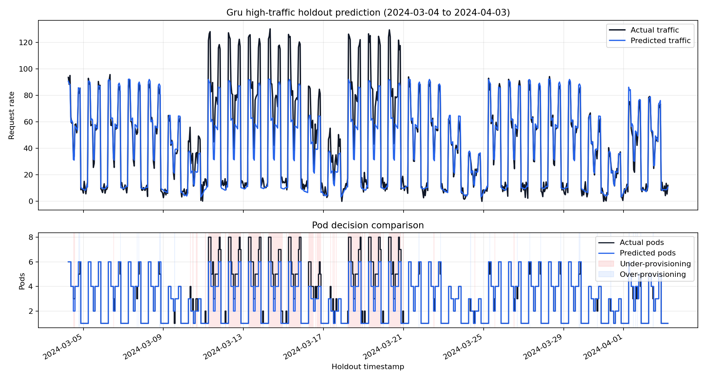
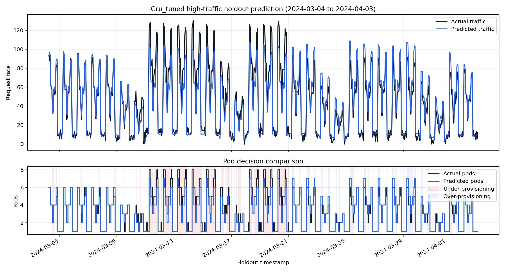
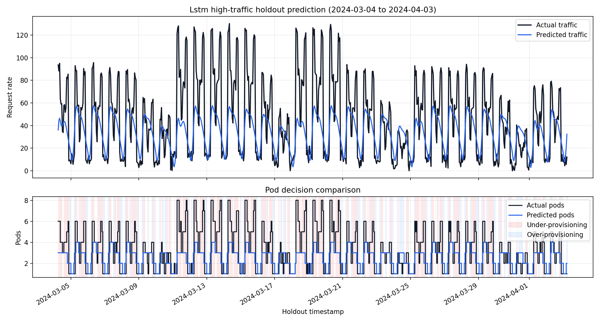
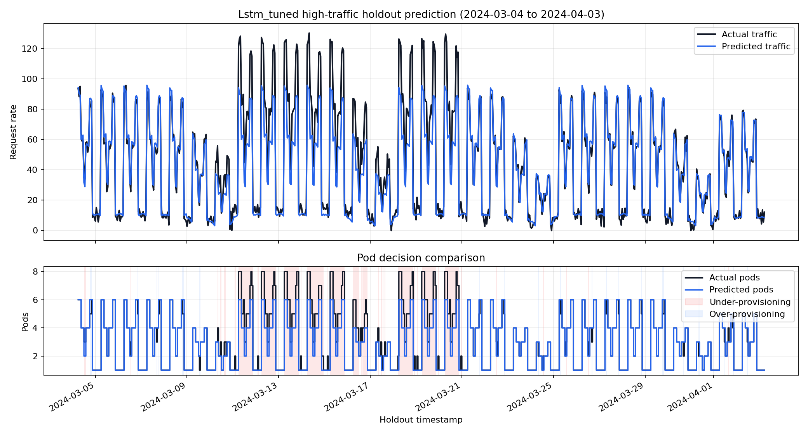

# AI Prediction Model Selection

Kubernetes predictive autoscaling에 사용할 트래픽 예측 모델을 선정하기 위한 실험 레포다. Prophet, SARIMA, GRU, LSTM을 동일한 데이터와 평가 기준으로 비교하고, 1차 비교에서 최종 후보로 선정된 GRU/LSTM에 대해 Optuna 기반 하이퍼파라미터 튜닝을 추가로 수행한다.

## 프로젝트 목적

Reactive autoscaling은 트래픽 증가가 발생한 뒤에 pod 수를 조정한다. 급격한 트래픽 증가가 발생하면 HPA가 반응하기 전까지 지연이 생기고, 이 구간에서 서비스 응답 지연이나 장애가 발생할 수 있다.

이 프로젝트는 트래픽을 사전에 예측하고 예측값을 required pod 수로 변환하여, Kubernetes autoscaling에 사용할 최종 예측 모델을 선정하는 것을 목표로 한다.

## 디렉터리 구조

```text
ai-prediction-model/
├─ README.md
├─ requirements.txt
├─ docs/
│  ├─ run-guide.md
│  ├─ problem-definition.md
│  ├─ experiment-design.md
│  ├─ model-selection-criteria.md
│  ├─ final-decision.md
│  ├─ prompt-log.md
│  ├─ assets/
│  └─ module-spec/
├─ src/
│  ├─ data/
│  │  └─ generate_dummy_data.py
│  ├─ models/
│  │  ├─ prophet/
│  │  ├─ sarima/
│  │  ├─ gru/
│  │  ├─ lstm/
│  │  └─ sequence_tune.py
│  ├─ evaluation/
│  │  ├─ compare_models.py
│  │  ├─ metrics.py
│  │  ├─ pod_policy.py
│  │  ├─ plot_holdout_comparison.py
│  │  ├─ plot_holdout_overview.py
│  │  └─ plot_sequence_tuning_comparison.py
│  ├─ optimization/
│  │  └─ autoscaling_score.py
│  └─ utils/
├─ data/
│  ├─ raw/
│  ├─ processed/
│  └─ predictions/
├─ experiments/
│  ├─ configs/
│  ├─ results/
│  └─ plots/
├─ models/
├─ notebooks/
└─ tests/
```

## 전체 파이프라인

```text
Synthetic agriculture traffic data
        |
        v
data/processed/traffic.csv
        |
        +--> Prophet baseline ---------> prophet_metrics.json
        +--> SARIMA baseline ----------> sarima_metrics.json
        +--> GRU baseline -------------> gru_metrics.json
        +--> LSTM baseline ------------> lstm_metrics.json
        |
        v
1차 모델 비교
        |
        +--> GRU 후보 선정
        +--> LSTM 후보 선정
        |
        +--> Optuna tuned GRU ---------> gru_tuned_metrics.json
        +--> Optuna tuned LSTM --------> lstm_tuned_metrics.json
        |
        v
experiments/results/comparison_results.csv
        |
        +--> docs/assets/*comparison*.png
        +--> docs/assets/*holdout*.png
        |
        v
experiments/results/best_model.json
```

실행 절차와 PowerShell 인코딩 등 트러블슈팅은 [실행 가이드](docs/run-guide.md)를 참고한다.

## 문제 정의

- 입력: 시간별 트래픽 데이터와 보조 feature
- 출력: holdout 구간의 트래픽 예측값과 required pod 수
- 목표: 동일한 데이터와 동일한 holdout 조건에서 후보 모델을 비교하고 최종 모델 선정 근거를 문서화
- Primary metric: Under-provisioning rate

자세한 문제 정의는 [docs/problem-definition.md](docs/problem-definition.md)를 참고한다.

## 후보 모델

| 모델 | 역할 |
| --- | --- |
| Prophet | 계절성과 이벤트성 변동을 빠르게 반영하는 baseline |
| SARIMA | 전통적인 통계 기반 시계열 baseline |
| GRU | 순차 패턴을 학습하는 경량 recurrent neural network |
| LSTM | 장기 의존성을 고려하는 recurrent neural network |

위 4개 모델을 먼저 동일 조건에서 비교한 뒤, autoscaling 지표가 우수한 GRU와 LSTM을 추가 최적화 대상으로 선정한다. Tuned GRU와 Tuned LSTM은 최초 후보 모델이 아니라, 1차 모델 선정 이후 후속 실험으로 생성한 모델이다.

## 데이터 생성 방식

Synthetic traffic data는 기존 `prophet-autoscaler`의 더미 데이터 생성 아이디어를 참고하여 새 구조에 맞게 재구성했다. 농자재 BNPL 서비스에서 주요 수요가 발생하는 작물은 벼, 고추, 콩, 마늘, 양파로 두고, 각 작물의 파종/정식, 생육 관리, 수확, 상환 조회 시기를 월별 activity로 반영한다.

기본 생성 기간은 `2020-01-01`부터 `2024-12-31 23:00`까지의 5년이며, 단위는 1시간이다.

반영된 패턴:

- 작물별 월별 계절성
- 요일별 패턴
- 시간대별 패턴
- 장마철 변동성
- 태풍 영향
- 이상치 이벤트

### 작물별 월별 Activity 기준

작물별 월별 activity는 내부 생성 로직에서 가중 평균되어 하나의 전체 농업 수요 계절성으로 반영된다. 가중치는 벼 `0.30`, 고추 `0.25`, 콩 `0.15`, 마늘 `0.15`, 양파 `0.15`로 둔다.

| 작물 | 주요 수요 시기 | 트래픽 반영 의도 |
| --- | --- | --- |
| 벼 | 3-5월 파종/모내기 준비, 9-10월 수확·상환 | 봄철 농자재 구매와 가을 상환 조회 반영 |
| 고추 | 3-4월 파종/정식, 7-9월 방제·수확·상환 | 연초 최고 피크와 여름 병충해/상환 수요 반영 |
| 콩 | 5-6월 파종 준비, 10-11월 수확·상환 | 초여름 구매와 가을 상환 조회 반영 |
| 마늘 | 5-6월 수확·상환, 10-11월 파종 | 여름 상환과 가을 파종 수요 반영 |
| 양파 | 5-6월 수확·상환, 9-10월 정식 | 봄/초여름 상환과 가을 정식 수요 반영 |

작물별 activity는 별도 모델 입력 컬럼으로 저장하지 않고, 기존 데이터 스키마를 유지한 채 `request_rate` 생성에만 반영한다. 이후 Prophet/SARIMA/GRU/LSTM 평가 코드는 기존 컬럼 기준으로 그대로 동작한다.

`data/processed/traffic.csv` 주요 컬럼:

- `ds`: timestamp
- `y`: 예측 대상 request rate
- `request_rate`: synthetic request rate
- `cpu_utilization`: synthetic CPU utilization
- `is_monsoon`: 장마 여부
- `typhoon_index`: 태풍 영향 지수
- `hour`, `day_of_week`, `month`: calendar features

## 전처리 방식

데이터 전처리는 raw synthetic data를 공통 모델 입력 파일로 만드는 단계와, 모델 학습 직전에 입력 형태를 맞추는 단계로 나뉜다.

### 공통 입력 데이터 구성

`src/data/generate_dummy_data.py`는 request rate, CPU utilization, anomaly event를 각각 raw CSV로 저장한 뒤, 모든 모델이 공통으로 사용할 `data/processed/traffic.csv`를 생성한다.

처리 과정:

1. `ds` 기준의 시간별 timestamp frame을 생성한다.
2. 작물별 월별 activity, 요일 패턴, 시간대 패턴을 synthetic traffic에 반영한다.
3. 장마 여부(`is_monsoon`)와 태풍 영향도(`typhoon_index`)를 weather feature로 추가한다.
4. spring purchase spike, post-typhoon recovery spike, monsoon volatility 같은 anomaly window를 주입한다.
5. request rate를 모델의 예측 target인 `y`로 사용한다.
6. calendar feature인 `hour`, `day_of_week`, `month`를 추가한다.

최종적으로 `traffic.csv`에 저장되는 컬럼은 다음과 같다.

```text
ds, is_monsoon, typhoon_index, request_rate, cpu_utilization, hour, day_of_week, month, y
```

### 모델 학습 전처리

모든 모델은 `src/models/common.py`의 공통 로직으로 `traffic.csv`를 읽고 timestamp 기준으로 정렬한 뒤, chronological split을 적용한다.

```text
train: 앞쪽 80%
holdout: 뒤쪽 20%
```

Random split은 사용하지 않는다. 시계열 예측 상황을 유지하기 위해 과거 데이터로 학습하고 미래 구간을 holdout으로 평가한다.

### 시간 순환 feature 변환

`hour`, `day_of_week`, `month`는 순환 feature다. `23시`와 `0시`, `12월`과 `1월`은 실제 시간 흐름에서는 이어져 있지만 raw integer로 넣으면 큰 숫자 차이로 인식될 수 있다.

SARIMA와 GRU/LSTM에서는 이를 보완하기 위해 `src/models/common.py`의 `build_model_feature_frame`에서 다음 sin/cos encoding을 적용한다.

```text
hour_sin = sin(2π * hour / 24)
hour_cos = cos(2π * hour / 24)

dow_sin = sin(2π * day_of_week / 7)
dow_cos = cos(2π * day_of_week / 7)

month_sin = sin(2π * (month - 1) / 12)
month_cos = cos(2π * (month - 1) / 12)
```

따라서 SARIMA와 GRU/LSTM이 실제 모델 입력으로 사용하는 feature는 다음과 같다.

```text
is_monsoon, typhoon_index,
hour_sin, hour_cos,
dow_sin, dow_cos,
month_sin, month_cos
```

Prophet은 `ds` timestamp 기반 seasonality를 내부에서 처리하므로 `hour`, `day_of_week`, `month`를 별도 cyclic feature로 넣지 않는다.

GRU와 LSTM은 추가로 sequence model 전용 전처리를 수행한다.

- 입력 컬럼: `y`와 위의 cyclic/weather feature
- train 구간의 평균과 표준편차로 scaling parameter를 계산한다.
- 같은 scaling parameter를 holdout 구간에도 적용한다.
- `sequence_length`만큼의 과거 window를 입력으로 만들고, 다음 시점의 `y`를 target으로 둔다.
- holdout 예측 시 실제 holdout `y`를 다음 window에 넣지 않고, 이전 예측값을 다시 입력으로 사용하는 recursive forecast 방식을 사용한다.

## 평가 기준

평가는 [src/evaluation/metrics.py](src/evaluation/metrics.py)와 [src/evaluation/pod_policy.py](src/evaluation/pod_policy.py)의 공통 로직을 사용한다.

기본 pod 정책:

```text
capacity_per_pod = 21.1
safety_margin = 0.2
min_pods = 1
max_pods = 8
```

| 지표 | 최적화 방향 | autoscaling 관점 |
| --- | --- | --- |
| SMAPE | 낮을수록 좋음 | 트래픽 예측 자체의 정확도 |
| Pod accuracy | 높을수록 좋음 | autoscaling decision 일치도 |
| Under-provisioning rate | 가장 낮아야 함 | 서비스 지연/장애 위험 |
| Over-provisioning rate | 낮을수록 비용 효율적 | 불필요한 pod 비용 |

Autoscaling에서는 pod 부족이 서비스 장애로 이어질 수 있으므로 under-provisioning rate를 primary metric으로 둔다. 자세한 기준은 [docs/model-selection-criteria.md](docs/model-selection-criteria.md)를 참고한다.

이 평가 기준은 두 단계에서 동일하게 적용한다. 1차 비교에서는 Prophet, SARIMA, GRU, LSTM 중 추가 최적화할 모델을 선정하고, 2차 비교에서는 선정된 GRU/LSTM과 tuned GRU/LSTM을 비교해 최종 사용 모델을 결정한다.

## 1차 모델 비교: 튜닝 대상 선정

5년치 synthetic data 기준으로 Prophet, SARIMA, GRU, LSTM 4개 후보 모델을 동일한 holdout 조건에서 비교했다. 이 단계의 목적은 모든 모델 중 최종 모델을 바로 확정하는 것이 아니라, Optuna로 추가 최적화할 sequence model 후보를 선정하는 것이다.

| Rank | 모델 | SMAPE | Pod accuracy | Under-provisioning rate | Over-provisioning rate | 비고 |
| ---: | --- | ---: | ---: | ---: | ---: | --- |
| 1 | GRU | 0.4064 | 0.8442 | 0.0426 | 0.1131 | 튜닝 대상 선정 |
| 2 | LSTM | 0.3931 | 0.8806 | 0.0555 | 0.0639 | 튜닝 대상 선정 |
| 3 | Prophet | 0.6368 | 0.6832 | 0.1268 | 0.1900 | baseline |
| 4 | SARIMA | 0.8197 | 0.6083 | 0.3762 | 0.0155 | statistical baseline |

GRU와 LSTM은 Prophet, SARIMA보다 under-provisioning rate와 pod accuracy 측면에서 더 좋은 결과를 보였다. 따라서 2차 실험에서는 GRU와 LSTM만 Optuna 튜닝 대상으로 선정했다.


## 최적화 방식

### 선정 모델 GRU/LSTM 튜닝

1차 비교에서 선정된 GRU와 LSTM에 대해 Optuna 기반 하이퍼파라미터 튜닝을 수행한다. 튜닝 objective score는 1차 비교와 동일하게 under-provisioning rate를 중심으로 SMAPE와 over-provisioning rate를 보조 penalty로 반영한다.

```text
score = under_provisioning_rate + 0.1 * smape + 0.2 * over_provisioning_rate
```

탐색 대상:

| 파라미터 | 의미 |
| --- | --- |
| `sequence_length` | 과거 몇 시간의 window를 입력으로 사용할지 정한다. |
| `hidden_size` | recurrent hidden state 크기를 조정한다. |
| `learning_rate` | Adam optimizer의 학습률을 조정한다. |
| `epochs` | 학습 반복 횟수를 조정한다. |
| `batch_size` | full-batch 또는 mini-batch 학습 방식을 조정한다. |
| `num_layers` | GRU/LSTM recurrent layer 수를 조정한다. |
| `dropout` | multi-layer sequence model의 dropout 비율을 조정한다. |
| `weight_decay` | L2 regularization 강도를 조정한다. |
| `gradient_clip` | gradient 폭주를 줄이기 위한 clipping 값을 조정한다. |

## 2차 모델 비교: 튜닝 전후 비교

2차 비교에서는 1차에서 선정된 GRU/LSTM과 Optuna로 생성한 Tuned GRU/Tuned LSTM을 비교했다. 이 단계의 목적은 튜닝이 실제 holdout 성능을 개선했는지 확인하고, 최종 사용 모델을 결정하는 것이다.

| 모델 | SMAPE | Pod accuracy | Under-provisioning rate | Over-provisioning rate | 비고 |
| --- | ---: | ---: | ---: | ---: | --- |
| GRU | 0.4064 | 0.8442 | 0.0426 | 0.1131 | 기본 모델 |
| Tuned GRU | 0.4117 | 0.8432 | 0.0667 | 0.0901 | Optuna tuning |
| LSTM | 0.3931 | 0.8806 | 0.0555 | 0.0639 | 기본 모델 |
| Tuned LSTM | 0.3835 | 0.8819 | 0.0666 | 0.0515 | Optuna tuning |

튜닝 결과, Tuned LSTM은 SMAPE, pod accuracy, over-provisioning rate를 개선했고 Tuned GRU도 over-provisioning rate를 낮췄다. 다만 최종 holdout의 primary metric인 under-provisioning rate는 기본 GRU/LSTM보다 높아졌다. 따라서 2차 비교에서는 서비스 안정성 기준을 우선해 primary metric이 가장 낮은 기본 GRU를 최종 사용 모델로 선정한다.


### 2차 비교 Holdout 상세









## 전체 Holdout Overview


## Troubleshooting

### 시간 feature 전처리 문제

초기 sequence/statistical 모델은 `hour`, `day_of_week`, `month`를 raw integer feature로 사용했다. 이 표현은 시간의 순환성을 반영하지 못해 GRU/LSTM 예측이 과대 진동하거나 SARIMA 예측이 불안정해지는 원인이 되었다.

전처리 및 학습 방식 개선 전후 지표는 다음과 같다.

| Model | Version | SMAPE | Pod accuracy | Under-provisioning | Over-provisioning |
| --- | --- | ---: | ---: | ---: | ---: |
| GRU | raw integer time | 0.7730 | 0.4829 | 0.1840 | 0.3331 |
| GRU | cyclic encoding + mini-batch | 0.4064 | 0.8442 | 0.0426 | 0.1131 |
| LSTM | raw integer time | 0.7652 | 0.5250 | 0.2083 | 0.2667 |
| LSTM | cyclic encoding + mini-batch | 0.3931 | 0.8806 | 0.0555 | 0.0639 |
| SARIMA | raw integer time | 1.8726 | 0.5895 | 0.4105 | 0.0000 |
| SARIMA | cyclic exog | 0.8197 | 0.6083 | 0.3762 | 0.0155 |

GRU/LSTM은 cyclic encoding과 mini-batch 학습 적용 후 성능이 크게 향상됐다. SARIMA는 0에 가까운 예측으로 붕괴하던 문제는 완화됐지만, 여전히 under-provisioning rate가 높았다.

### SARIMA 학습 시간 및 수렴 문제

SARIMA는 전체 train 구간 35,078행과 seasonal order `1,0,1,24` 조합에서 학습 시간이 매우 길었고, 다음 수렴 경고가 발생했다.

```text
Maximum Likelihood optimization failed to converge
```

예측 결과는 생성됐지만 under-provisioning rate가 `0.3762`로 높아 autoscaling 후보로는 부적합하다고 판단했다.

### GRU/LSTM 튜닝 일반화 문제

Optuna 튜닝은 validation objective 기준으로 낮은 score를 갖는 조합을 찾았지만, 최종 holdout에서는 기본 GRU/LSTM보다 under-provisioning rate가 높아졌다.

| Model | Version | Under-provisioning |
| --- | --- | ---: |
| GRU | baseline | 0.0426 |
| GRU | tuned | 0.0667 |
| LSTM | baseline | 0.0555 |
| LSTM | tuned | 0.0666 |

튜닝 모델은 일부 보조 지표를 개선했지만, under-provisioning rate 기준에서는 기본 모델보다 안정적이지 않았다. 이는 현재 validation split과 탐색 공간이 마지막 holdout 구간의 pod 부족 위험을 충분히 낮추는 방향으로 일반화되지 못했음을 의미한다. 따라서 이번 실험에서는 tuned 모델이 아니라 기본 GRU를 최종 모델로 선정한다.

## 최종 사용 모델

최종 사용 모델은 **GRU**로 선정한다.

선정 기준은 Kubernetes predictive autoscaling에서 가장 중요한 지표를 under-provisioning rate로 두었기 때문이다. 1차 비교에서 GRU와 LSTM을 튜닝 대상으로 선정했고, 튜닝 이후 기본 GRU/LSTM과 tuned GRU/LSTM을 함께 비교했다. 이 최종 비교에서 GRU는 under-provisioning rate가 `0.0426`으로 가장 낮아, 실제 필요한 pod 수보다 적게 예측할 위험이 가장 작다.

LSTM과 Tuned LSTM은 SMAPE와 pod accuracy가 GRU보다 좋지만, primary metric인 under-provisioning rate는 GRU보다 높다. Optuna tuned GRU/LSTM은 일부 보조 지표를 개선했지만 최종 holdout의 pod 부족 위험을 기본 GRU보다 낮추지 못해 최종 후보에서 제외한다.

## 참고 문서

- [실행 가이드](docs/run-guide.md)
- [문제 정의](docs/problem-definition.md)
- [실험 설계](docs/experiment-design.md)
- [모델 선정 기준](docs/model-selection-criteria.md)
- [최종 모델 선정 결과](docs/final-decision.md)
- [프롬프트 기록](docs/prompt-log.md)
