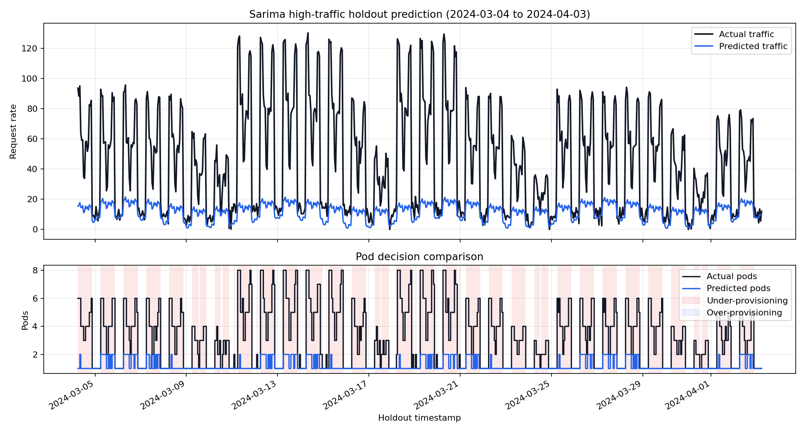

# AI Prediction Model Selection

Kubernetes predictive autoscaling에 사용할 traffic forecasting 모델을 비교하고, pod 부족 위험을 줄이는 후보 모델을 선정하기 위한 실험 레포다.

이 README는 프로젝트의 문제 정의, synthetic data 설계 기준, 모델별 입력 전략, 평가 기준, 최신 실험 결과와 현재 후보 모델 판단을 요약한다. 실행 명령어와 세부 실험 기록은 `docs/`에 분리해 관리한다.

## 프로젝트 목적

Kubernetes HPA는 현재 또는 최근 리소스 사용량을 보고 반응하는 방식이기 때문에, 트래픽이 급격히 증가하는 시점에는 pod 증설이 늦어질 수 있다. 농업 BNPL 서비스처럼 특정 작물 시즌, 날씨 이벤트, 구매 집중 기간에 트래픽이 몰리는 도메인에서는 reactive autoscaling만으로는 순간적인 pod 부족을 막기 어렵다.

이 프로젝트의 목적은 과거 traffic pattern을 기반으로 미래 request rate를 예측하고, 예측값을 필요한 pod 수로 변환해 predictive autoscaling 후보 모델을 선정하는 것이다.

Autoscaling 관점에서는 실제 필요한 pod 수보다 적게 예측하는 under-provisioning이 서비스 지연이나 장애로 이어질 수 있으므로, under-provisioning rate를 primary metric으로 둔다. 반대로 over-provisioning은 비용 문제이므로 보조 지표로 함께 본다.

## 프로젝트 구조

이 레포는 데이터 생성, 모델 학습, 평가, 문서화를 분리해 관리한다.

```text
ai-prediction-model/
├─ data/
│  ├─ raw/                  # 생성된 원천 형태의 dummy CSV
│  ├─ processed/            # 모델 공통 입력 데이터
│  └─ predictions/          # 모델별 holdout 예측 결과
├─ docs/
│  ├─ assets/               # README/docs에서 사용하는 시각화 이미지
│  ├─ experiment-notes.md   # 세부 실험 기록
│  └─ run-guide.md          # 실행 방법
├─ experiments/
│  ├─ plots/                # 비교 그래프 출력
│  └─ results/              # 모델별 metric JSON, 비교 CSV
├─ models/                  # GRU/LSTM 학습 artifact
├─ src/
│  ├─ data/                 # synthetic data generator
│  ├─ evaluation/           # metric, pod policy, plotting
│  └─ models/               # Prophet, SARIMA, GRU, LSTM 학습 코드
└─ tests/                   # 단위 테스트
```

## 전체 파이프라인

실험 파이프라인은 synthetic traffic data를 생성한 뒤, 동일한 holdout 구간에서 모델을 비교하고 pod-level metric으로 후보를 선정하는 흐름이다.

```text
Synthetic data generation
        |
        v
data/processed/traffic.csv
        |
        v
Train / holdout split
        |
        +--> Prophet baseline
        +--> SARIMA baseline
        +--> GRU sequence model
        +--> LSTM sequence model
        |
        v
data/predictions/{model}_predictions.csv
        |
        v
experiments/results/{model}_metrics.json
        |
        v
Metric comparison + holdout visualization
        |
        v
Candidate model decision
```

## 문제 정의

- 예측 대상: 시간 단위 request rate `y`
- 활용 목적: 예측 request rate 기반 필요 pod 수 산정
- 실험 방식: 5년치 hourly data 중 앞쪽 80%를 train, 뒤쪽 20%를 holdout으로 사용
- 최우선 목표: holdout 구간의 under-provisioning rate 최소화

모델은 단순히 traffic 값을 정확히 맞추는 것만으로 평가하지 않는다. 예측값이 Kubernetes pod decision으로 변환됐을 때 실제 필요 pod보다 부족한지, 과하게 많은지까지 함께 평가한다.

## 데이터셋

기본 데이터 경로는 `data/processed/traffic.csv`다. 현재 데이터는 2020-01-01부터 2024-12-31 23:00까지의 5년치 시간 단위 synthetic traffic data다.

| Split | Rows | Period |
| --- | ---: | --- |
| Train | 35,078 | 2020-01-01 00:00 - 2024-01-01 13:00 |
| Holdout | 8,770 | 2024-01-01 14:00 - 2024-12-31 23:00 |

주요 컬럼은 다음과 같다.

| Column | Description |
| --- | --- |
| `ds` | timestamp |
| `y` | 예측 대상 request rate |
| `is_monsoon` | 장마 여부 |
| `typhoon_index` | 태풍 영향 지수 |
| `hour` | 시간대, 0-23 |
| `day_of_week` | 요일, 0-6 |
| `month` | 월, 1-12 |

## 더미 데이터 생성 기준

실제 서비스 traffic data는 접근 제약과 개인정보/운영정보 노출 위험이 있으므로, 모델 비교를 위한 재현 가능한 synthetic data를 생성했다. 단순 랜덤 데이터가 아니라 농업 BNPL 서비스에서 기대할 수 있는 계절성, 요일성, 시간대 패턴, 날씨 이벤트, 이상 트래픽을 조합했다.

traffic target은 다음 구조를 따른다.

```text
request_rate =
  base_request_rate
  * crop_activity_score
  * weekly_weight
  * hourly_weight
  * typhoon_effect
  * monsoon_effect
  * anomaly_boost
  + noise
```

생성 기준은 다음과 같다.

| Component | Description |
| --- | --- |
| Crop activity | 쌀, 고추, 콩, 마늘, 양파의 월별 activity weight를 조합 |
| Weekly pattern | 평일 traffic을 높게, 주말 traffic을 낮게 반영 |
| Hourly pattern | 오전/저녁 피크와 야간 저점 반영 |
| Monsoon | 매년 6월 말-7월 말 장마 구간 반영 |
| Typhoon | 매년 8-9월 중 태풍 영향 지수 생성 |
| Anomaly | 봄 구매 spike, 태풍 이후 복구 spike, 장마 변동성 주입 |
| Noise | base request rate의 3% 수준 Gaussian noise 추가 |

이 설계는 모델이 단순 추세뿐 아니라 월별 농업 시즌, 주간/일간 반복 패턴, 날씨 이벤트, 갑작스러운 spike를 함께 다룰 수 있는지 확인하기 위한 것이다.

## 전처리 과정

모든 모델은 `data/processed/traffic.csv`를 기준 입력으로 사용한다. `ds`를 시간 순서로 정렬한 뒤 동일한 train/holdout split을 적용하고, 모델 특성에 맞게 입력 feature를 구성한다.

공통 전처리 흐름은 다음과 같다.

1. `ds` 기준으로 데이터를 시간 순서 정렬
2. `ds`에서 `hour`, `day_of_week`, `month` 생성
3. 앞쪽 80%를 train, 뒤쪽 20%를 holdout으로 분리
4. 모델별 입력 feature 구성
5. GRU/LSTM은 train 구간 통계로 standard scaling 적용

### 시간 순환 feature 변환

`hour`, `day_of_week`, `month`는 순환 feature다. `23시`와 `0시`, `12월`과 `1월`은 실제 시간 흐름에서는 이어져 있지만 raw integer로 넣으면 큰 숫자 차이로 인식될 수 있다.

SARIMA와 GRU/LSTM에서는 이를 보완하기 위해 다음 sin/cos encoding을 적용한다.

```text
hour_sin = sin(2π * hour / 24)
hour_cos = cos(2π * hour / 24)

dow_sin = sin(2π * day_of_week / 7)
dow_cos = cos(2π * day_of_week / 7)

month_sin = sin(2π * (month - 1) / 12)
month_cos = cos(2π * (month - 1) / 12)
```

### 모델별 전처리 차이

| Model | Preprocessing |
| --- | --- |
| Prophet | `ds`, `y`, `is_monsoon`, `typhoon_index` 사용. 시간 seasonality는 Prophet 내부에서 처리 |
| SARIMA | `is_monsoon`, `typhoon_index`, cyclic time feature를 exog로 사용 |
| GRU | `y`와 외생 feature를 포함한 sequence window 생성 후 scaling |
| LSTM | GRU와 동일한 sequence preprocessing 사용 |

GRU/LSTM은 neural network 모델이므로 train 구간의 평균과 표준편차로 `y`와 feature를 standard scaling한다. 같은 scaling parameter를 holdout 구간에도 적용한다. Prophet과 SARIMA는 별도 standard scaling 없이 원래 scale의 `y`를 사용한다.

## 비교 모델 및 입력 전략

모든 모델은 동일한 원천 데이터와 동일한 holdout 구간으로 평가한다. 다만 입력 feature 구성은 모델 특성에 맞게 다르게 설계했다.

| Model | Input strategy | Role |
| --- | --- | --- |
| Prophet | `ds` 기반 seasonality + weather regressors | time-series baseline |
| SARIMA | cyclic time exog + weather regressors | statistical baseline |
| GRU | `y` sequence + cyclic time/weather features | sequence model |
| LSTM | `y` sequence + cyclic time/weather features | sequence model |

### GRU/LSTM 학습 방식

GRU/LSTM은 `y`의 과거 window와 외생 feature를 함께 입력하는 sequence model이다. 현재 실험에서는 하루 단위 흐름을 입력 window로 반영하기 위해 기본 `sequence_length=24`를 사용한다.

초기 실험의 full-batch 학습은 epoch 수만큼만 optimizer update가 발생해 학습이 부족할 수 있었다. 현재 학습 방식은 다음과 같이 정리했다.

- `DataLoader` 기반 mini-batch 학습
- 기본 `batch_size=256`
- 기본 `epochs=50`
- `torch.nn.Module` 기반 모델 구조
- 학습 시 `model.train()`, holdout 추론 시 `model.eval()` 사용

## 평가 기준

예측 request rate는 pod policy를 통해 pod 수로 변환한다.

```text
effective_capacity = capacity_per_pod * (1 - safety_margin)
required_pods = clip(ceil(max(request_rate, 0) / effective_capacity), min_pods, max_pods)
```

현재 policy는 다음 값을 사용한다.

| Parameter | Value |
| --- | ---: |
| `capacity_per_pod` | 21.1 |
| `safety_margin` | 0.2 |
| `effective_capacity` | 16.88 |
| `min_pods` | 1 |
| `max_pods` | 8 |

모델 선정 우선순위는 다음과 같다. 표 안의 `N`은 holdout timestamp 수를 의미한다.

| Priority | Metric | Formula | Direction |
| ---: | --- | --- | --- |
| 1 | Under-provisioning rate | `(1 / N) * sum(1[predicted_pods < actual_pods])` | Lower is better |
| 2 | SMAPE | `(1 / N) * sum(abs(y - y_hat) / ((abs(y) + abs(y_hat)) / 2))` | Lower is better |
| 3 | Pod accuracy | `(1 / N) * sum(1[predicted_pods == actual_pods])` | Higher is better |
| 4 | Over-provisioning rate | `(1 / N) * sum(1[predicted_pods > actual_pods])` | Lower is better |

SMAPE는 traffic value 예측 오차를 보고, 나머지 세 지표는 실제 autoscaling decision의 품질을 본다. 이 프로젝트에서는 pod 부족을 가장 위험한 실패로 보기 때문에 under-provisioning rate를 primary metric으로 둔다.

## 현재 실험 결과

아래 표는 기본 모델 비교 결과다. 순위는 primary metric인 under-provisioning rate 기준이다.

| Rank | Model | SMAPE | Pod accuracy | Under-provisioning | Over-provisioning |
| ---: | --- | ---: | ---: | ---: | ---: |
| 1 | GRU | 0.4064 | 0.8442 | 0.0426 | 0.1131 |
| 2 | LSTM | 0.3931 | 0.8806 | 0.0555 | 0.0639 |
| 3 | Prophet | 0.6368 | 0.6832 | 0.1268 | 0.1900 |
| 4 | SARIMA | 0.8197 | 0.6083 | 0.3762 | 0.0155 |


## 결과 해석

GRU는 under-provisioning rate가 가장 낮아 pod 부족 위험을 줄이는 관점에서 가장 유리했다. Primary metric 기준으로는 현재 1순위 후보다.

LSTM은 GRU보다 under-provisioning rate는 약간 높지만, SMAPE, pod accuracy, over-provisioning rate에서 가장 균형적인 결과를 보였다. 운영 비용과 예측 정확도의 균형을 본다면 강한 보조 후보로 볼 수 있다.

Prophet은 안정적인 baseline이지만, 개선된 GRU/LSTM과 비교하면 primary metric에서 뒤처졌다. 다만 Prophet은 별도 복잡한 sequence 학습 없이 timestamp seasonality를 안정적으로 처리한다는 장점이 있다.

SARIMA는 cyclic exog 적용 후에도 수렴 문제가 발생했고 under-provisioning rate가 높아 최종 후보에서 제외했다.


### GRU holdout 비교


### LSTM holdout 비교


### Prophet holdout 비교


### SARIMA holdout 비교



## Troubleshooting

### 시간 feature 전처리 문제

초기 sequence/statistical 모델은 `hour`, `day_of_week`, `month`를 raw integer feature로 사용했다. 이 표현은 시간의 순환성을 반영하지 못해 GRU/LSTM 예측이 과대 진동하거나 SARIMA 예측이 불안정해지는 원인이 되었다.

전처리 및 학습 방식 개선 전후 지표는 다음과 같다.

| Model | Version | SMAPE | Pod accuracy | Under-provisioning | Over-provisioning |
| --- | --- | ---: | ---: | ---: | ---: |
| GRU | raw integer time | 0.7730 | 0.4829 | 0.1840 | 0.3331 |
| GRU | cyclic encoding + mini-batch | 0.4064 | 0.8442 | 0.0426 | 0.1131 |
| LSTM | raw integer time | 0.7652 | 0.5250 | 0.2083 | 0.2667 |
| LSTM | cyclic encoding + mini-batch | 0.3931 | 0.8806 | 0.0555 | 0.0639 |
| SARIMA | raw integer time | 1.8726 | 0.5895 | 0.4105 | 0.0000 |
| SARIMA | cyclic exog | 0.8197 | 0.6083 | 0.3762 | 0.0155 |

GRU/LSTM은 전처리와 학습 방식 개선 후 성능이 크게 향상됐다. SARIMA는 0에 가까운 예측으로 붕괴하던 문제는 완화됐지만, 여전히 under-provisioning rate가 높았다.

### SARIMA 학습 시간 및 수렴 문제

SARIMA는 전체 train 구간 35,078행과 seasonal order `1,0,1,24` 조합에서 학습 시간이 매우 길었고, 다음 수렴 경고가 발생했다.

```text
Maximum Likelihood optimization failed to converge
```

예측 결과는 생성됐지만 under-provisioning rate가 `0.3762`로 높아 autoscaling 후보로는 부적합하다고 판단했다.

## 현재 기준 후보 모델

현재 기본 모델 비교 기준 1순위 후보는 GRU다. Primary metric인 under-provisioning rate가 가장 낮아 autoscaling 안정성 관점에서 가장 좋은 결과를 보였다.

LSTM은 보조 후보로 유지한다. Under-provisioning rate는 GRU보다 높지만, SMAPE, pod accuracy, over-provisioning rate에서 더 균형적인 결과를 보였다.

다만 GRU/LSTM은 아직 별도 hyperparameter tuning을 수행하지 않았다. 최종 운영 모델 확정 전 sequence model tuning을 수행하는 것이 자연스러운 다음 단계다.

## 참고 문서

- [실행 가이드](docs/run-guide.md)
- [실험 설계](docs/experiment-design.md)
- [모델 선정 기준](docs/model-selection-criteria.md)
- [문제 정의](docs/problem-definition.md)
- [실험 기록](docs/experiment-notes.md)
- [시각화 자료](docs/assets/)
