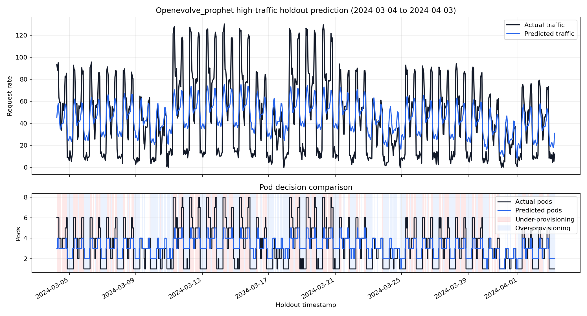

# AI Prediction Model Selection

이 프로젝트는 Kubernetes predictive autoscaling에 적합한 트래픽 예측 모델을 선정하기 위해 Prophet, SARIMA, GRU, LSTM을 동일 조건에서 비교한다.

## 프로젝트 목적

Reactive autoscaling은 트래픽 증가가 발생한 뒤에 pod 수를 조정한다. 급격한 트래픽 증가가 발생하면 HPA가 반응하기 전까지 지연이 생기고, 이 구간에서 서비스 응답 지연이나 장애가 발생할 수 있다.

이 레포는 트래픽을 사전에 예측하고 예측값을 required pod 수로 변환하여, Kubernetes autoscaling에 사용할 최종 예측 모델을 선정하는 것을 목표로 한다.

## 문제 정의

- 입력: 시간별 트래픽 데이터와 보조 feature
- 출력: holdout 구간의 트래픽 예측값과 required pod 수
- 목표: 동일한 데이터와 동일한 holdout 조건에서 후보 모델을 비교하고 최종 모델 선정 근거를 문서화
- Primary metric: Under-provisioning rate

자세한 문제 정의는 [docs/problem-definition.md](docs/problem-definition.md)를 참고한다.

## 후보 모델

| 모델 | 역할 |
| --- | --- |
| Prophet | 계절성과 이벤트성 변동을 빠르게 반영하는 baseline |
| SARIMA | 전통적인 통계 기반 시계열 baseline |
| GRU | 순차 패턴을 학습하는 경량 recurrent neural network |
| LSTM | 장기 의존성을 고려하는 recurrent neural network |

## 전체 파이프라인

```text
Synthetic traffic data
        |
        v
data/processed/traffic.csv
        |
        +--> Prophet train/evaluate --> prophet_metrics.json
        +--> SARIMA  train/evaluate --> sarima_metrics.json
        +--> GRU     train/evaluate --> gru_metrics.json
        +--> LSTM    train/evaluate --> lstm_metrics.json
        |
        v
experiments/results/comparison_results.csv
        |
        v
experiments/results/best_model.json
```

## 데이터 생성 방식

Synthetic traffic data는 기존 `prophet-autoscaler`의 더미 데이터 생성 아이디어를 참고하여 새 구조에 맞게 재구성했다. 농자재 BNPL 서비스에서 주요 수요가 발생하는 작물은 벼, 고추, 콩, 마늘, 양파로 두고, 각 작물의 파종/정식, 생육 관리, 수확, 상환 조회 시기를 월별 activity로 반영한다.

기본 생성 기간은 5년이다.

- 시작: `2020-01-01`
- 종료: `2024-12-31 23:00`
- 단위: 1시간

반영된 패턴:

- 작물별 월별 계절성
- 요일별 패턴
- 시간대별 패턴
- 장마철 변동성
- 태풍 영향
- 이상치 이벤트

### 작물별 월별 activity 기준

작물별 월별 activity는 내부 생성 로직에서 가중 평균되어 하나의 전체 농업 수요 계절성으로 반영된다. 가중치는 벼 `0.30`, 고추 `0.25`, 콩 `0.15`, 마늘 `0.15`, 양파 `0.15`로 둔다.

| 작물 | 주요 수요 시기 | 트래픽 반영 의도 |
| --- | --- | --- |
| 벼 | 3~5월 파종/모내기 준비, 9~10월 수확·상환 | 봄철 농자재 구매와 가을 상환 조회 반영 |
| 고추 | 3~4월 파종/정식, 7~9월 방제·수확·상환 | 연초 최고 피크와 여름 병충해/상환 수요 반영 |
| 콩 | 5~6월 파종 준비, 10~11월 수확·상환 | 초여름 구매와 가을 상환 조회 반영 |
| 마늘 | 5~6월 수확·상환, 10~11월 파종 | 여름 상환과 가을 파종 수요 반영 |
| 양파 | 5~6월 수확·상환, 9~10월 정식 | 봄/초여름 상환과 가을 정식 수요 반영 |
 
작물별 activity는 별도 모델 입력 컬럼으로 저장하지 않고, 기존 데이터 스키마를 유지한 채 `request_rate` 생성에만 반영한다. 모델 공통 target은 이 통합 계절성과 요일/시간대/기상/이상치 효과를 곱해 생성한 `request_rate`다.

데이터 생성:

```bash
python -m src.data.generate_dummy_data
```

출력 파일:

- `data/raw/dummy_request_rate.csv`
- `data/raw/dummy_cpu_utilization.csv`
- `data/raw/dummy_anomaly_events.csv`
- `data/processed/traffic.csv`

`data/processed/traffic.csv`는 모든 모델이 공통으로 사용하는 입력 데이터다.

주요 컬럼:

- `ds`: timestamp
- `y`: 예측 대상 request rate
- `request_rate`: synthetic request rate
- `cpu_utilization`: synthetic CPU utilization
- `is_monsoon`: 장마 여부
- `typhoon_index`: 태풍 영향 지수
- `hour`, `day_of_week`, `month`: calendar features

작물별 월별 activity는 위 컬럼에 추가하지 않는다. 데이터 생성 단계에서 하나의 통합 계절성으로 합쳐져 `request_rate`와 `y`에 반영되므로, 이후 Prophet/SARIMA/GRU/LSTM 및 OpenEvolve 평가 코드는 기존 컬럼 기준으로 그대로 동작한다.

## 실험 조건

모든 모델은 다음 원칙을 따른다.

- 동일한 입력 파일 사용: `data/processed/traffic.csv`
- 동일한 train/holdout split 사용: 기본 5년 데이터의 마지막 20%, 약 1년을 holdout으로 평가
- 동일한 평가 지표 사용
- 동일한 pod 산정 정책 사용
- 모델별 결과를 동일한 위치에 저장

자세한 실험 설계는 [docs/experiment-design.md](docs/experiment-design.md)를 참고한다.

## 평가 지표

평가는 [src/evaluation/metrics.py](src/evaluation/metrics.py)와 [src/evaluation/pod_policy.py](src/evaluation/pod_policy.py)의 공통 로직을 사용한다.

### Pod 산정식

```text
effective_capacity = capacity_per_pod * (1 - safety_margin)
raw_pods = ceil(max(request_rate, 0) / effective_capacity)
required_pods = min(max(raw_pods, min_pods), max_pods)
```

기본 pod 정책:

```text
capacity_per_pod = 21.1
safety_margin = 0.2
min_pods = 1
max_pods = 8
```

### Metric 정의

**SMAPE**

```text
mean(abs(y - yhat) / ((abs(y) + abs(yhat)) / 2))
```

실제 트래픽과 예측 트래픽의 상대 오차를 나타낸다.

**Pod accuracy**

```text
mean(actual_pods == predicted_pods)
```

예측 pod 수가 실제 필요 pod 수와 정확히 일치한 비율이다.

**Under-provisioning rate**

```text
mean(predicted_pods < actual_pods)
```

실제 필요 pod 수보다 적게 예측한 비율이다.

**Over-provisioning rate**

```text
mean(predicted_pods > actual_pods)
```

실제 필요 pod 수보다 많이 예측한 비율이다.

여기서 `y`는 실제 request rate, `yhat`은 예측 request rate다. `actual_pods`는 실제 request rate로 계산한 필요 pod 수이고, `predicted_pods`는 예측 request rate로 계산한 필요 pod 수다.

| 지표 | 최적화 방향 | autoscaling 관점 |
| --- | --- | --- |
| SMAPE | 낮을수록 좋음 | 트래픽 예측 자체의 정확도 |
| Pod accuracy | 높을수록 좋음 | autoscaling decision 일치도 |
| Under-provisioning rate | 가장 낮아야 함 | 서비스 지연/장애 위험 |
| Over-provisioning rate | 낮을수록 비용 효율적 | 불필요한 pod 비용 |

Autoscaling에서는 pod 부족이 서비스 장애로 이어질 수 있으므로 under-provisioning rate를 primary metric으로 둔다.

자세한 기준은 [docs/model-selection-criteria.md](docs/model-selection-criteria.md)를 참고한다.

## 실행 방법

1. 의존성 설치

```bash
pip install -r requirements.txt
```

Windows PowerShell에서 한글 출력이 깨지면 현재 세션을 UTF-8로 맞춘 뒤 명령을 실행한다.

```powershell
chcp 65001
[Console]::InputEncoding = [System.Text.UTF8Encoding]::new()
[Console]::OutputEncoding = [System.Text.UTF8Encoding]::new()
$OutputEncoding = [System.Text.UTF8Encoding]::new()
```

2. 데이터 생성

```bash
python -m src.data.generate_dummy_data
```

3. 모델별 학습 및 평가

```bash
python -m src.models.prophet.train
python -m src.models.sarima.train
python -m src.models.gru.train
python -m src.models.lstm.train
```

각 모델은 다음 파일을 생성한다.

- `data/predictions/{model}_predictions.csv`
- `experiments/results/{model}_metrics.json`
- `models/{model}.pt` for GRU/LSTM

4. 전체 모델 비교

```bash
python -m src.evaluation.compare_models
```

비교 결과 저장 위치:

- `experiments/results/comparison_results.csv`
- `experiments/results/best_model.json`
- `experiments/plots/model_comparison.png`

5. Prophet 하이퍼파라미터 튜닝

```bash
python -m src.models.prophet.tune --trials 30 --n-jobs 2
```

튜닝은 Optuna로 수행하며, objective score는 under-provisioning rate를 중심으로 SMAPE와 over-provisioning rate를 보조 penalty로 반영한다.
`--n-jobs`는 병렬 trial 수이며, Prophet은 trial마다 CPU를 많이 사용하므로 로컬 환경에서는 `2`부터 확인하는 것을 권장한다.

```text
score = under_provisioning_rate + 0.1 * smape + 0.2 * over_provisioning_rate
```

Optuna 탐색 대상은 Prophet 모델 구조를 고정한 상태의 하이퍼파라미터다.

| 파라미터 | 의미 |
| --- | --- |
| `changepoint_prior_scale` | 추세 변화점에 얼마나 민감하게 반응할지 조정한다. 값이 크면 피크와 급격한 변화에 더 유연하지만 과적합 위험이 커진다. |
| `seasonality_prior_scale` | 일/주/연 단위 계절성 패턴을 얼마나 강하게 반영할지 조정한다. |
| `holidays_prior_scale` | 이벤트성 효과를 얼마나 강하게 허용할지 조정한다. 이 프로젝트에서는 농업 이벤트성 변동에 대한 유연성을 조절하는 역할을 한다. |
| `changepoint_range` | 학습 데이터 중 어느 구간까지 changepoint 후보를 둘지 정한다. 값이 크면 후반부 데이터까지 추세 변화 후보에 포함한다. |
| `seasonality_mode` | 계절성을 `additive` 또는 `multiplicative` 방식으로 반영할지 결정한다. 트래픽 규모가 커질수록 계절성 진폭도 커지는 경우 `multiplicative`가 유리할 수 있다. |

튜닝 결과 저장 위치:

- `experiments/results/prophet_tuning_trials.csv`
- `experiments/results/prophet_best_params.json`
- `experiments/results/prophet_tuning_summary.json`
- `experiments/results/prophet_tuned_metrics.json`
- `data/predictions/prophet_tuned_predictions.csv`

저장된 best params로 기본 학습 스크립트를 다시 실행할 수도 있다.

```bash
python -m src.models.prophet.train --params-path experiments/results/prophet_best_params.json
```

6. OpenEvolve 기반 Prophet 모델 구성 최적화

OpenEvolve는 Prophet 라이브러리 자체가 아니라 Prophet 모델 recipe를 최적화한다. 진화 대상은 하이퍼파라미터, engineered regressor, custom seasonality, target transformation hook이다.

Optuna가 정해진 파라미터 공간을 탐색하는 방식이라면, OpenEvolve는 Prophet 모델을 구성하는 코드 단위의 선택지를 탐색한다.

| 최적화 대상 | 의미 |
| --- | --- |
| Prophet 하이퍼파라미터 | 추세 변화 민감도, 계절성 강도, changepoint 범위, seasonality mode 등을 조정한다. |
| Regressor 선택 | Prophet에 외생 변수로 추가할 feature 조합을 선택한다. |
| Feature engineering | 원본 컬럼에서 `is_peak_hour`, `is_weekend`, `monsoon_typhoon` 같은 파생 feature를 만든다. |
| Custom seasonality | 기본 daily/weekly/yearly seasonality 외에 monthly seasonality 같은 주기를 추가한다. |
| Target transform hook | 필요하면 학습 target과 예측값을 변환하는 구조를 탐색할 수 있게 한다. |

- `experiments/openevolve/prophet_model/initial_program.py`
- `experiments/openevolve/prophet_model/evaluator.py`
- `experiments/openevolve/prophet_model/config.yaml`
- `experiments/openevolve/prophet_model/README.md`

선정된 OpenEvolve Prophet recipe 실행:

```bash
python -m src.models.prophet.openevolve_train
```

출력 파일:

- `data/predictions/openevolve_prophet_predictions.csv`
- `experiments/results/openevolve_prophet_metrics.json`

선정된 recipe 요약:

- Regressor: `is_monsoon`, `typhoon_index`, `is_peak_hour`, `is_weekend`, `monsoon_typhoon`
- Prophet 설정: additive seasonality, `changepoint_prior_scale=0.1`, `seasonality_prior_scale=10.0`, `holidays_prior_scale=1.0`, `changepoint_range=0.8`
- Custom seasonality: period `30.5`, Fourier order `5`인 monthly seasonality

7. holdout 시각화

```bash
python -m src.evaluation.plot_holdout_overview
python -m src.evaluation.plot_holdout_comparison --model prophet
python -m src.evaluation.plot_holdout_comparison --model prophet_tuned
```

문서용 시각화 자료는 `docs/assets/`에 저장된다. 1년 overview는 전체 holdout 추세를 확인하기 위한 그래프이고, 30일 상세 그래프는 Prophet 기본 모델과 튜닝 모델의 고트래픽 구간 autoscaling decision을 확인하기 위한 그래프다.

## 최종 모델 선정 방식

모델 ranking은 다음 순서로 판단한다.

1. Under-provisioning rate 낮은 모델
2. SMAPE 낮은 모델
3. Pod accuracy 높은 모델
4. Over-provisioning rate 낮은 모델

최종 선정 결과와 근거는 [docs/final-decision.md](docs/final-decision.md)에 기록한다.

## 현재 실험 결과

현재 5년치 synthetic data 기준 1차 모델 비교에서는 Prophet이 최종 후보 모델로 선정되었다.

| Rank | 모델 | SMAPE | Pod accuracy | Under-provisioning rate | Over-provisioning rate |
| ---: | --- | ---: | ---: | ---: | ---: |
| 1 | Prophet | 0.6369 | 0.6834 | 0.1268 | 0.1899 |
| 2 | GRU | 0.7730 | 0.4829 | 0.1840 | 0.3331 |
| 3 | LSTM | 0.7652 | 0.5250 | 0.2083 | 0.2667 |
| 4 | SARIMA | 1.8726 | 0.5895 | 0.4105 | 0.0000 |


Prophet은 후보 모델 비교에서 primary metric인 under-provisioning rate가 가장 낮고, pod accuracy와 SMAPE도 가장 좋아 최종 후보 모델로 선정했다. 상세 근거는 [docs/final-decision.md](docs/final-decision.md)를 참고한다.

아래 그래프는 1차 모델 비교 결과를 전체 holdout 약 1년 기준으로 시각화한 것이다. 일 단위 평균으로 압축해 실제 트래픽/예측 트래픽과 실제 pod/예측 pod 흐름을 함께 비교한다.


### Prophet 튜닝 결과

1차 비교에서 선정된 Prophet에 대해 Optuna 기반 하이퍼파라미터 튜닝을 수행했다. 튜닝 결과는 Prophet 기본 설정과 같은 평가 지표로 비교한다.

| 모델 | SMAPE | Pod accuracy | Under-provisioning rate | Over-provisioning rate |
| --- | ---: | ---: | ---: | ---: |
| Prophet | 0.6369 | 0.6834 | 0.1268 | 0.1899 |
| Tuned Prophet | 0.6338 | 0.6796 | 0.1238 | 0.1966 |
| OpenEvolve Prophet | 0.6347 | 0.6861 | 0.1253 | 0.1886 |

Tuned Prophet은 `30` trials 기준 Optuna 튜닝 결과에서 under-provisioning rate를 `0.1268`에서 `0.1238`로 낮췄고, SMAPE도 `0.6369`에서 `0.6338`로 소폭 개선했다. 다만 pod accuracy는 `0.6834`에서 `0.6796`으로 낮아졌고, over-provisioning rate는 `0.1899`에서 `0.1966`으로 증가했다. 따라서 튜닝 결과는 서비스 안정성 지표를 소폭 개선한 대신 비용 측면의 trade-off가 생긴 것으로 해석한다.

OpenEvolve Prophet은 전체 train/full holdout 재검증 기준 SMAPE `0.6347`, pod accuracy `0.6861`, under-provisioning rate `0.1253`, over-provisioning rate `0.1886`을 기록했다. OpenEvolve objective 기준 penalty score는 `0.2414`, combined score는 `0.8055`이다.

최종 ranking 기준에서는 Tuned Prophet이 under-provisioning rate가 가장 낮아 1위이고, OpenEvolve Prophet은 2위이다. 다만 OpenEvolve Prophet은 Tuned Prophet보다 pod accuracy가 높고 over-provisioning rate가 낮아 비용/decision 안정성 측면에서 장점이 있다.

아래 그래프는 holdout 구간에서 실제 트래픽 평균이 가장 높은 30일을 자동 선택해 실제 트래픽/예측 트래픽과 실제 필요 pod/예측 pod를 함께 비교한 것이다. Prophet 기본 모델, 튜닝 모델, OpenEvolve 모델을 같은 고트래픽 구간에서 비교해 autoscaling decision 변화를 확인한다. pod 그래프의 붉은 음영은 under-provisioning, 파란 음영은 over-provisioning 구간을 의미한다.

### Prophet


### Tuned Prophet


### OpenEvolve Prophet



## 디렉터리 구조

```text
ai-prediction-model/
├─ README.md
├─ requirements.txt
├─ docs/
│  ├─ problem-definition.md
│  ├─ experiment-design.md
│  ├─ model-selection-criteria.md
│  ├─ final-decision.md
│  ├─ prompt-log.md
│  ├─ assets/
│  └─ module-spec/
├─ src/
│  ├─ data/
│  │  └─ generate_dummy_data.py
│  ├─ models/
│  │  ├─ prophet/
│  │  │  ├─ train.py
│  │  │  ├─ tune.py
│  │  │  └─ openevolve_train.py
│  │  ├─ sarima/
│  │  ├─ gru/
│  │  └─ lstm/
│  ├─ evaluation/
│  │  ├─ compare_models.py
│  │  ├─ metrics.py
│  │  ├─ pod_policy.py
│  │  ├─ plot_holdout_comparison.py
│  │  └─ plot_holdout_overview.py
│  └─ utils/
├─ data/
│  ├─ raw/
│  ├─ processed/
│  └─ predictions/
├─ experiments/
│  ├─ configs/
│  ├─ openevolve/
│  ├─ results/
│  └─ plots/
├─ models/
├─ notebooks/
└─ tests/
```

## 최종 사용 모델

최종 사용 모델은 **Tuned Prophet**으로 선정한다.

선정 기준은 Kubernetes predictive autoscaling에서 가장 중요한 지표를 under-provisioning rate로 두었기 때문이다. Tuned Prophet은 비교 대상 중 under-provisioning rate가 `0.1238`로 가장 낮아, 실제 필요한 pod 수보다 적게 예측할 위험이 가장 작다.

| 모델 | SMAPE | Pod accuracy | Under-provisioning rate | Over-provisioning rate |
| --- | ---: | ---: | ---: | ---: |
| Prophet | 0.6369 | 0.6834 | 0.1268 | 0.1899 |
| Tuned Prophet | 0.6338 | 0.6796 | 0.1238 | 0.1966 |
| OpenEvolve Prophet | 0.6347 | 0.6861 | 0.1253 | 0.1886 |

OpenEvolve Prophet은 pod accuracy와 over-provisioning rate에서 가장 좋은 결과를 보였지만, primary metric인 under-provisioning rate 기준으로는 Tuned Prophet보다 낮지 않았다. 따라서 최종 운영 후보는 Tuned Prophet으로 두고, OpenEvolve Prophet은 추가 최적화 가능성이 있는 보조 후보로 정리한다.

## 참고 문서

- [문제 정의](docs/problem-definition.md)
- [실험 설계](docs/experiment-design.md)
- [모델 선정 기준](docs/model-selection-criteria.md)
- [최종 모델 선정 결과](docs/final-decision.md)
- [프롬프트 기록](docs/prompt-log.md)
