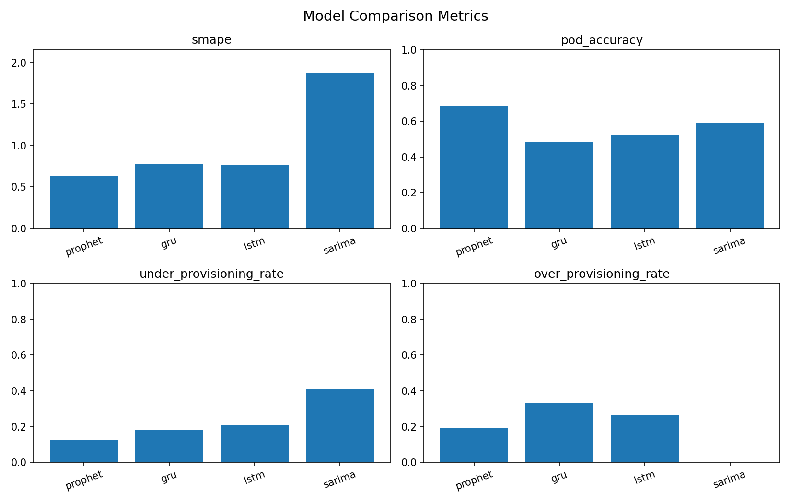
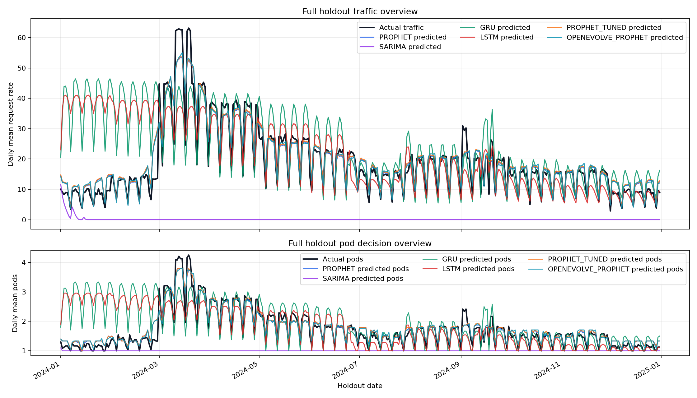
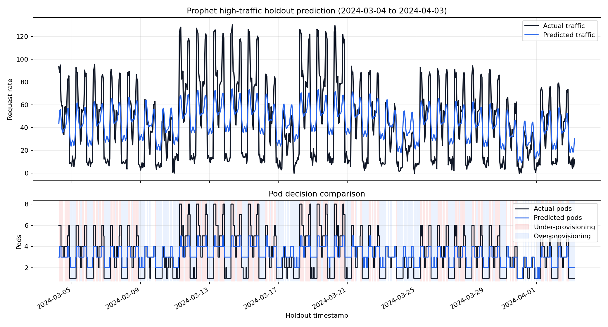
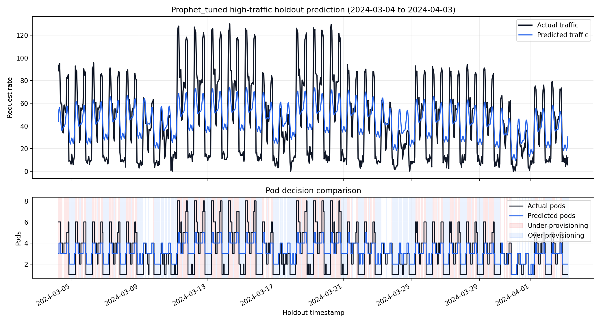

# 최종 모델 선정

## 실험 결과 요약

5년치 synthetic traffic data를 생성하고, 앞쪽 80%를 train, 뒤쪽 20%를 holdout으로 사용했다.

- Train rows: 35,078
- Holdout rows: 8,770
- Holdout 기간: 마지막 약 1년
- Primary metric: Under-provisioning rate

## 모델 비교 결과

| Rank | 모델 | SMAPE | Pod accuracy | Under-provisioning rate | Over-provisioning rate | 비고 |
| ---: | --- | ---: | ---: | ---: | ---: | --- |
| 1 | Prophet | 0.6369 | 0.6834 | 0.1268 | 0.1899 | 최종 선정 |
| 2 | GRU | 0.7730 | 0.4829 | 0.1840 | 0.3331 | sequence model |
| 3 | LSTM | 0.7652 | 0.5250 | 0.2083 | 0.2667 | sequence model |
| 4 | SARIMA | 1.8726 | 0.5895 | 0.4105 | 0.0000 | statistical baseline |

1차 모델 비교에서는 Prophet이 under-provisioning rate, SMAPE, pod accuracy 기준에서 가장 안정적인 결과를 보여 최종 후보 모델로 선정되었다.

## 모델 비교 그래프



## 전체 Holdout Overview



위 그래프는 전체 holdout 약 1년을 일 단위 평균으로 압축해 실제 트래픽/예측 트래픽과 실제 pod/예측 pod 흐름을 비교한 것이다. 장기 추세와 계절성 추종 여부를 확인하기 위한 보조 자료로 사용한다.

## Prophet holdout 상세 비교



위 그래프는 Prophet의 holdout 예측 결과에서 실제 트래픽 평균이 가장 높은 30일 구간을 자동 선택한 것이다. 상단은 실제 트래픽과 예측 트래픽을 비교하고, 하단은 실제 필요 pod 수와 예측 pod 수를 비교한다.

붉은 음영은 예측 pod 수가 실제 필요 pod 수보다 적은 under-provisioning 구간이고, 파란 음영은 예측 pod 수가 실제 필요 pod 수보다 많은 over-provisioning 구간이다. 최종 모델 선정에서는 전체 holdout metric을 우선 사용하되, 이 그래프를 통해 pod 부족이 발생하는 시점과 예측 패턴을 함께 검토한다.

## 선정 기준

최종 모델은 다음 순서로 선정했다.

1. Under-provisioning rate 낮은 모델
2. SMAPE 낮은 모델
3. Pod accuracy 높은 모델
4. Over-provisioning rate 낮은 모델

## 최종 선정 모델

```text
Prophet
```

## 선정 근거

Prophet은 under-provisioning rate가 `0.1268`로 가장 낮았다. Autoscaling 환경에서는 pod 부족이 서비스 지연이나 장애로 이어질 수 있으므로, under-provisioning rate를 primary metric으로 두었고 이 기준에서 Prophet이 가장 안정적이었다.

또한 Prophet은 pod accuracy도 `0.6834`로 후보 모델 중 가장 높았다. SMAPE 역시 `0.6369`로 가장 낮아, traffic value 예측과 pod decision 측면 모두에서 가장 균형이 좋았다.

GRU와 LSTM은 sequence model로서 비선형 패턴을 학습할 가능성이 있지만, 이번 기본 설정에서는 under-provisioning rate와 pod accuracy 모두 Prophet보다 낮았다. SARIMA는 over-provisioning rate가 0으로 추가 pod 비용은 적지만, under-provisioning rate가 높아 autoscaling 안정성 기준에서는 적합하지 않았다.

## 한계 및 후속 개선

- GRU/LSTM은 기본 hyperparameter로만 실행했으므로 튜닝 여지가 있다.
- SARIMA는 5년 hourly 데이터에서 학습 비용이 높고, order 후보 탐색이 필요하다.
- 이번 결과는 synthetic data 기준이므로 실제 운영 metric으로 재검증해야 한다.
- Prophet은 최종 선정 모델이므로 Optuna 기반 하이퍼파라미터 튜닝을 통해 under-provisioning rate 중심의 추가 최적화를 수행할 수 있다.

## Prophet 튜닝 방법

Prophet 튜닝은 모델 선정 이후의 후속 최적화 단계로 둔다. 1차 모델 비교에서 선정된 Prophet만 대상으로 삼아 autoscaling metric을 개선한다.

## Prophet 튜닝 결과

| 모델 | SMAPE | Pod accuracy | Under-provisioning rate | Over-provisioning rate | 비고 |
| --- | ---: | ---: | ---: | ---: | --- |
| Prophet | 0.6369 | 0.6834 | 0.1268 | 0.1899 | 기본 설정 |
| Tuned Prophet | 0.6338 | 0.6796 | 0.1238 | 0.1966 | Optuna tuning |

Tuned Prophet은 `30` trials 기준 Optuna 튜닝 결과에서 under-provisioning rate를 `0.1268`에서 `0.1238`로 낮췄고, SMAPE도 `0.6369`에서 `0.6338`로 소폭 개선했다. 다만 pod accuracy는 `0.6834`에서 `0.6796`으로 낮아졌고, over-provisioning rate는 `0.1899`에서 `0.1966`으로 증가했다. 따라서 튜닝 결과는 서비스 안정성 지표를 소폭 개선한 대신 비용 측면의 trade-off가 생긴 것으로 해석한다.

## Tuned Prophet holdout 상세 비교



위 그래프는 튜닝된 Prophet의 같은 고트래픽 30일 구간 예측 결과다. 기본 Prophet 그래프와 함께 비교해 튜닝 이후 under-provisioning과 over-provisioning 구간이 어떻게 달라지는지 확인한다.

튜닝 대상 파라미터:

- `changepoint_prior_scale`
- `seasonality_prior_scale`
- `holidays_prior_scale`
- `changepoint_range`
- `seasonality_mode`

Objective score:

```text
score = under_provisioning_rate + 0.1 * smape + 0.2 * over_provisioning_rate
```

이 score는 under-provisioning rate를 가장 중요하게 두되, 예측값을 과하게 높여 over-provisioning을 늘리는 방향으로만 최적화되지 않도록 SMAPE와 over-provisioning rate를 보조 penalty로 사용한다.

튜닝 결과는 다음 파일에 저장한다.

- `experiments/results/prophet_tuning_trials.csv`
- `experiments/results/prophet_best_params.json`
- `experiments/results/prophet_tuning_summary.json`
- `experiments/results/prophet_tuned_metrics.json`
- `data/predictions/prophet_tuned_predictions.csv`
