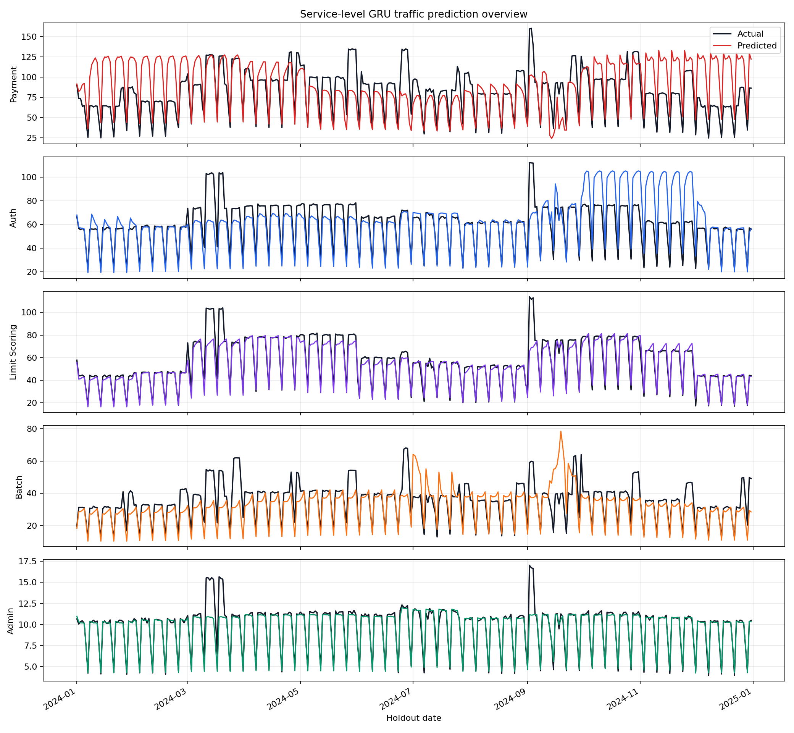
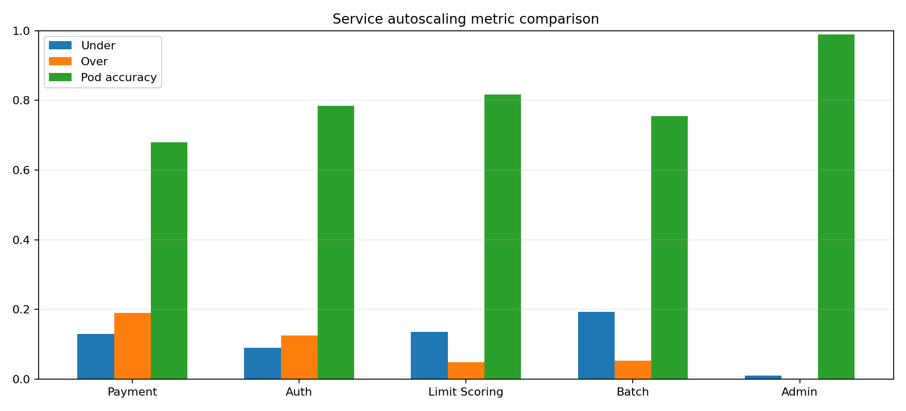
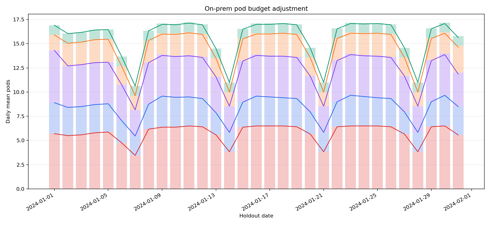

# On-prem BNPL Pod Ratio Scaling

농업 BNPL 업무 서비스를 대상으로 고정된 온프레미스 pod budget 안에서 서비스별 pod 비율을 조정하는 실험이다.

운영 목표는 노드 증설이 아니라, 총 pod 수를 제한한 상태에서 `payment`, `auth`, `limit_scoring`, `batch`, `admin` 사이의 비율을 예측 기반으로 조정하는 것이다.

## 대상 서비스

| Service | 업무 범위 | 더미 데이터 패턴 |
| --- | --- | --- |
| `auth` | 로그인/회원가입 | 오전/저녁 로그인 피크, 농자재 구매 시즌 가입 증가 |
| `payment` | 결제 | 작물별 수확철, 상환일, 월말, 태풍 복구 이후 증가 |
| `batch` | BSS, ASS, DB 연동 API 포함 | 새벽 배치, 월말/분기말, queue/db 사용량 증가 |
| `admin` | 관리자 | 평일 근무시간 중심, 계절 영향 약함 |
| `limit_scoring` | 한도산정 | 파종/농자재 구매 시즌, 신청 이벤트, CPU/queue 부담 |

## 더미 데이터 생성 방식

메인 README의 작물별 activity, 요일/시간대, 장마/태풍, anomaly 생성 방식을 그대로 재사용하고, 서비스별 multiplier를 추가한다.

```text
payment_request
= base
* crop_activity_score
* repayment_day_boost
* service_hour_weight
* weekly_weight
* weather/anomaly_effect
+ noise
```

기본 설정으로 생성하면 5년치 1시간 단위 데이터가 만들어진다.

| 구분 | 값 |
| --- | ---: |
| 전체 기간 | `2020-01-01 00:00:00` ~ `2024-12-31 23:00:00` |
| 서비스별 row 수 | `43,848` |
| 전체 row 수 | `219,240` |
| 데이터 파일 | `data/processed/onprem_bnpl_service_traffic.csv` |

## 실행 방법

```powershell
.\.venv\Scripts\python.exe -m src.data.generate_service_dummy_data
.\.venv\Scripts\python.exe -m src.models.gru.train_service --onprem-pod-budget 8
.\.venv\Scripts\python.exe -m src.evaluation.plot_service_autoscaling
```

## Pod 산정 로직

```text
effective_capacity = capacity_per_pod * (1 - safety_margin)
required_pods = ceil(request_rate / effective_capacity)
required_pods = clip(required_pods, min_pods, max_pods)
```

서비스별 정책은 `configs/service_policies.json`에서 관리한다.

## 온프레미스 Scaling Decision

온프레미스 환경은 노드 확장이 제한적이라고 보고 전체 pod budget을 둔다. 현재 목표 운영 시나리오는 총 pod 8개 고정이다.

```text
pod_budget = 8
```

예측된 pod 합이 budget 이하이면 그대로 적용한다. 초과하면 모든 서비스의 `min_pods`를 먼저 보장한 뒤, predicted demand와 priority를 기준으로 남은 pod를 배분한다.

단, `min_pods` 합은 반드시 `pod_budget` 이하가 되어야 한다. pod budget을 8로 운영할 경우 현재 정책 파일도 최소 pod 합이 8 이하가 되도록 조정해야 한다.

```text
service_gru_*.pt
-> service별 predicted_request_rate
-> predicted_pods
-> 중앙 allocator
-> onprem_adjusted_pods
-> Prometheus metric
-> KEDA service별 ScaledObject
```

`.pt` 모델이 직접 pod 수를 출력하는 것은 아니다. 모델 출력은 서비스별 `predicted_request_rate`이고, `predicted_pods`와 `onprem_adjusted_pods`는 후처리 정책으로 계산한다.

KEDA와 Prometheus에는 `predicted_pods`가 아니라 `onprem_adjusted_pods`를 노출한다.

```text
bnpl_service_adjusted_pods{service="payment"} 3
bnpl_service_adjusted_pods{service="auth"} 2
bnpl_service_adjusted_pods{service="limit_scoring"} 1
bnpl_service_adjusted_pods{service="batch"} 1
bnpl_service_adjusted_pods{service="admin"} 1
```

같은 timestamp 기준으로 위 값의 합이 pod budget 8을 넘지 않아야 한다.

## 산출물

```text
experiments/service_autoscaling/onprem_bnpl/results/service_predictions.csv
experiments/service_autoscaling/onprem_bnpl/results/service_gru_metrics.csv
experiments/service_autoscaling/onprem_bnpl/results/onprem_scaling_decisions.csv
experiments/service_autoscaling/onprem_bnpl/results/service_gru_summary.json
```

## aiops-platform ERD 매핑

최종 운영 연동은 `mcp-aiops-backend` 기획서의 Prediction Metric / KEDA ERD를 따른다.

| aiops-platform table | 이 실험 산출물 | 매핑 |
| --- | --- | --- |
| `model_versions` | `models/service_gru_*.pt`, `service_gru_summary.json` | 모델명, 버전, 서비스별 artifact path |
| `prediction_runs` | `service_gru_summary.json` | 학습/예측 실행 이력, run status, horizon/window 정보 |
| `prediction_metrics` | `service_predictions.csv`, `onprem_scaling_decisions.csv` | `predicted` -> predicted RPS, `predicted_pods`, `onprem_adjusted_pods` |
| `actual_metrics` | Prometheus actual metric | target time 이후 실제 RPS/CPU |
| `prediction_error_metrics` | `service_predictions.csv` + actual metric | 예측값과 실제값 오차 |
| `scaling_events` | KEDA/HPA/K8s event | 실제 scale out/in event |

이 레포지토리는 모델 실험과 allocator 산출물을 만들고, backend의 `prediction-runner`, `prediction-metric-exporter`, `scaling-event-collector`, `prediction-scaling-mcp`가 DB 저장, `/metrics` 노출, scaling event 수집, 리포트/RCA 분석을 담당한다.

## 온프레 노드 전달 파일

온프레 노드 또는 backend 컨테이너에 전달할 핵심 파일은 다음과 같다.

```text
models/service_gru_admin.pt
models/service_gru_auth.pt
models/service_gru_batch.pt
models/service_gru_limit_scoring.pt
models/service_gru_payment.pt
experiments/service_autoscaling/onprem_bnpl/configs/service_policies.json
experiments/service_autoscaling/onprem_bnpl/results/service_predictions.csv
experiments/service_autoscaling/onprem_bnpl/results/onprem_scaling_decisions.csv
experiments/service_autoscaling/onprem_bnpl/results/service_gru_summary.json
```

재학습 또는 운영 inference까지 backend에서 수행하려면 `.pt` 파일 외에도 feature 목록, sequence length, hidden size, scaler mean/std 같은 metadata를 함께 artifact로 패키징해야 한다.

## 현재 결과 요약

정식 5년치 데이터와 기본 학습 설정 기준 서비스별 모델 예측 metric은 다음과 같다. 아래 표는 모델 예측 품질과 pod 산정 품질을 보기 위한 실험 결과이며, pod budget 8 운영 시 최종 배분은 `onprem_adjusted_pods`를 기준으로 다시 확인해야 한다.

| Service | SMAPE | Pod accuracy | Under-provisioning | Over-provisioning | Severe under | Pod change |
| --- | ---: | ---: | ---: | ---: | ---: | ---: |
| `admin` | 0.2984 | 0.9893 | 0.0107 | 0.0000 | 0.0000 | 0.0000 |
| `auth` | 0.1931 | 0.7848 | 0.0893 | 0.1259 | 0.0138 | 0.1660 |
| `batch` | 0.2776 | 0.7547 | 0.1927 | 0.0526 | 0.0202 | 0.1544 |
| `limit_scoring` | 0.1816 | 0.8161 | 0.1358 | 0.0481 | 0.0086 | 0.2959 |
| `payment` | 0.3199 | 0.6803 | 0.1299 | 0.1899 | 0.0772 | 0.2773 |

해석:

- `admin`은 트래픽 패턴이 단순하고 min pod 정책이 충분해 pod decision이 안정적이다.
- `payment`는 priority가 가장 높지만 pod accuracy가 낮고 severe under-provisioning이 가장 높아 safety margin 또는 capacity/max pod 정책 보정 후보이다.
- `batch`는 under-provisioning rate가 가장 높아 request rate 외에 queue depth 기반 scaling metric을 추가로 반영할 여지가 있다.
- `limit_scoring`은 예측 정확도는 좋지만 pod change rate가 높아 smoothing 또는 scale cooldown 정책을 검토할 수 있다.

## 시각화

```text
docs/assets/onprem_bnpl_traffic_overview.png
docs/assets/onprem_bnpl_metric_comparison.png
docs/assets/onprem_bnpl_pod_adjustment.png
```






